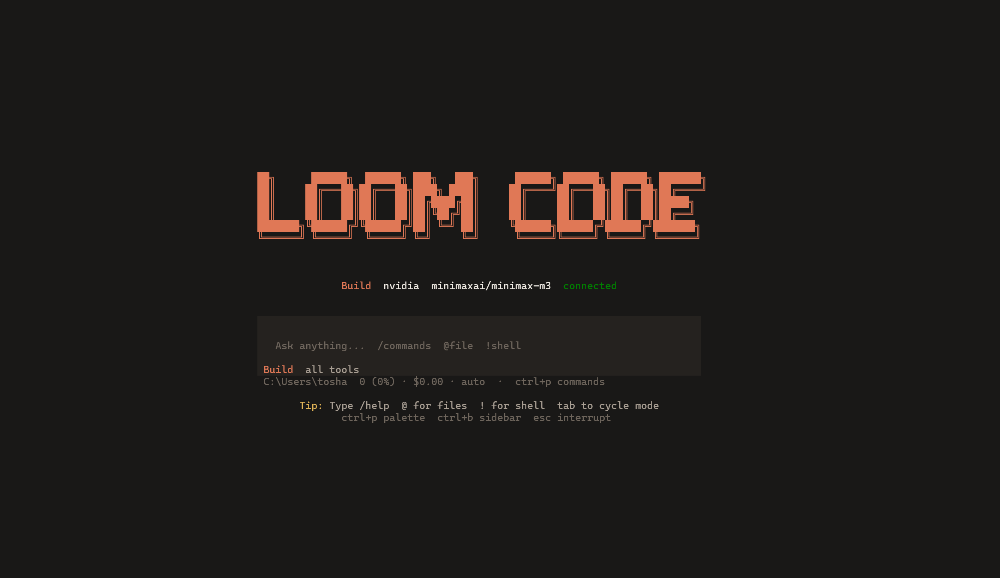

```
 ██╗      ██████╗  ██████╗ ███╗   ███╗      ██████╗ ██████╗ ██████╗ ███████╗
 ██║     ██╔═══██╗██╔═══██╗████╗ ████║     ██╔════╝██╔═══██╗██╔══██╗██╔════╝
 ██║     ██║   ██║██║   ██║██╔████╔██║     ██║     ██║   ██║██║  ██║█████╗
 ██║     ██║   ██║██║   ██║██║╚██╔╝██║     ██║     ██║   ██║██║  ██║██╔══╝
 ███████╗╚██████╔╝╚██████╔╝██║ ╚═╝ ██║     ╚██████╗██████╔╝██████╔╝███████╗
 ╚══════╝ ╚═════╝  ╚═════╝ ╚═╝     ╚═╝      ╚═════╝╚═════╝ ╚═════╝ ╚══════╝
```

[](https://www.npmjs.com/package/loom-agent)
[](LICENSE)
[](#)



An AI-powered coding agent for the terminal with multi-provider support and a full terminal UI.

## Features

- Full OpenTUI interface with slash commands, autocomplete, and ESC-to-interrupt
- Build / Plan / Chat modes 
- OpenCode-style agents — primary agents (`build`/`plan`/`chat`) plus delegating subagents (`explore`, `scout`, `general`) invoked automatically via the `task` tool or manually via `@agent` mentions
- LOOM.md project memory file 
- Multi-provider: Anthropic, OpenAI, NVIDIA, Google Gemini, OpenRouter, Local (Ollama)
- Built-in tools: read, write, edit, bash, grep, glob, webfetch, todowrite
- Agentic tool loop (multiple tool calls per turn)
- MCP (Model Context Protocol) server integration
- Drag-to-copy selections, paste support
- Session memory, /undo, /redo, /compact, /reset, /fork
- One-shot print mode: `loom -p "query"`
- Editor integration via the Agent Client Protocol (ACP): `loom acp` (JSON-RPC over stdio) so Zed, JetBrains, and Neovim plugins can drive Loom as their coding agent
- Browser interface via `loom web` — a zero-dependency Node HTTP server (chat in the browser, password auth, CORS) plus `loom attach` to share the same server from the terminal; optional mDNS advertising as `loom.local` via [bonjour-service](https://www.npmjs.com/package/bonjour-service)
- Usage & billing tracking per session + lifetime

## Prerequisites

- **[bun](https://bun.sh) >= 1.0** (required for the full TUI). Without bun, only the line-mode REPL runs.
- **Node.js >= 18** (for non-TUI mode and package scripts)
- **An API key** from at least one provider:

| Provider | Sign-up | Key type |
|----------|---------|----------|
| Anthropic | [console.anthropic.com](https://console.anthropic.com) | Claude API key |
| OpenAI | [platform.openai.com](https://platform.openai.com) | API key |
| NVIDIA | [build.nvidia.com](https://build.nvidia.com) | NIM API key (free tier available) |
| Google | [aistudio.google.com](https://aistudio.google.com) | Gemini API key (free tier available) |
| OpenRouter | [openrouter.ai](https://openrouter.ai) | OpenRouter API key |
| Local | Install [Ollama](https://ollama.com) | No key needed (runs locally) |

Install from npm (global — installs the `loom` command):
```bash
npm install -g loom-agent
```

Or run from source:
```bash
npm install -g .
# or
npm link
```

## Setup

1. **Install bun** (for the full TUI):
   ```bash
   # macOS / Linux
   curl -fsSL https://bun.sh/install | bash

   # Windows
   powershell -c "irm bun.sh/install.ps1 | iex"
   ```

2. **Configure API keys** — pick one method:
   ```bash
   # a) Environment variables (.env)
   cp .env.example .env
   # Edit .env with your key:
   # ANTHROPIC_API_KEY=sk-ant-...
   # NVIDIA_API_KEY=nvapi-...
   # OPENAI_API_KEY=sk-...

   # b) Interactive setup in the TUI
   loom
   > /connect nvidia
   ```

3. **Initialize project memory** (optional):
   ```bash
   loom
   > /init
   ```
   Creates `LOOM.md` with a project-specific template.

## Usage

```bash
loom                              # interactive TUI session
loom "explain this project"       # start with initial prompt
loom -p "list files in src/"      # one-shot, print result, exit
cat logs.txt | loom -p "explain"  # analyze piped content
loom --version
loom --help
loom --basic                      # skip TUI, use line-mode REPL
loom acp                          # ACP subprocess mode for editor integrations
loom web                          # browser interface (HTTP server, opens browser)
loom attach http://localhost:4096 # attach the terminal to a running loom web
```

## Web

Loom runs in your browser with `loom web` — a zero-dependency HTTP server that
serves a single-page UI and drives the same core session loop as the TUI. Same
providers/models, tools, MCP servers, and saved sessions; chat streams live in
the browser, and a shared terminal client can attach to the same server.

```bash
loom web                           # 127.0.0.1, random port, opens the browser
loom web --port 4096               # fixed port
loom web --hostname 0.0.0.0        # reachable on the LAN
loom web --mdns                    # advertise as loom.local (implies 0.0.0.0)
loom web --mdns-domain proj.local  # custom mDNS domain
loom web --cors https://example.com
LOOM_SERVER_PASSWORD=secret loom web   # password-protect (user: LOOM_SERVER_USERNAME, default "loom")

# Attach the terminal (shares the server's sessions/state):
loom attach http://localhost:4096
```

Config-file equivalent (`~/.loom/config.json`): `{ "server": { "port": 4096,
"hostname": "0.0.0.0", "mdns": true, "cors": ["https://example.com"] } }` — CLI
flags take precedence. Full flags, the JSON API, and `loom attach` options are
documented in **[docs/web.md](docs/web.md)**.

## Editor integration (ACP)

Loom implements the [Agent Client Protocol (ACP)](https://agentclientprotocol.com)
as `loom acp` — a JSON-RPC-over-stdio subprocess server that any ACP-compatible
editor can launch, the same mechanism opencode uses with Zed. Zed, JetBrains,
and Neovim (Avante.nvim / CodeCompanion.nvim) all support ACP agents; you only
configure the agent command `loom acp`, then chat from the editor while Loom
runs real tools in your repo.

Zed (add to `~/.config/zed/settings.json`, then Command Palette → `agent: new thread`):

```json
{
  "agent_servers": {
    "Loom Code": { "type": "custom", "command": "loom", "args": ["acp"], "env": {} }
  }
}
```

Full transport spec, JetBrains/Neovim configs, the protocol walkthrough, and a
self-test client (`node scripts/acp-smoke.js`) live in **[docs/acp.md](docs/acp.md)**.

## Slash Commands (35 total)

| Command | Args | Description |
|---------|------|-------------|
| `/help` | — | Show all commands |
| `/build` | — | Build mode — all tools |
| `/plan` | — | Plan mode — read-only analysis |
| `/chat` | — | Chat mode — no tools |
| `/agents` | — | List primary agents and subagents |
| `/connect` | `[provider]` | Add/connect a provider |
| `/key` | — | Edit API key for current provider |
| `/baseurl` | `[provider] [url]` | Set provider base URL |
| `/model` | `[model-id]` | Pick active model |
| `/models` | — | List available models |
| `/providers` | — | List supported providers |
| `/status` | — | Show connection status |
| `/usage` | — | Show token usage and billing |
| `/new` | — | Start a new session |
| `/clear` | — | Clear the chat |
| `/compact` | — | Compact conversation |
| `/undo` | — | Undo last exchange |
| `/redo` | — | Redo last undone exchange |
| `/reset` | — | Reset the session |
| `/settings` | — | Toggle details/sidebar/etc. |
| `/sessions` | — | Browse saved sessions |
| `/share` | — | Export current session to JSON |
| `/export` | — | Export to markdown |
| `/thinking` | — | Toggle thinking visibility |
| `/details` | — | Toggle tool detail visibility |
| `/init` | — | Create LOOM.md |
| `/memory` | — | Show memory files |
| `/doctor` | — | Run diagnostics |
| `/skills` | `install\|remove` | Manage skills |
| `/mcp` | `add\|remove\|toggle` | Manage MCP servers |
| `/debug` | — | Show debug info |
| `/fork` | — | Fork conversation |
| `/exit` | — | Quit Loom Code |

## Keybindings

Every key is configurable from `~/.loom/tui.json` (`keybinds`, `leader`,
`leader_timeout`) — see [docs/keybinds.md](docs/keybinds.md) for the full
action list, syntax, and opencode-compatible aliases. The defaults:

| Key | Action |
|-----|--------|
| **ESC** | Interrupt current operation (aborts API requests) / close dialogs / clear the draft |
| **Ctrl+C** | Exit (copies a text selection first) |
| **Ctrl+B** | Toggle sidebar (file browser) |
| **Ctrl+P** | Open command palette |
| **Ctrl+X** | Leader key — the next key runs a leader binding |
| **Ctrl+X** then **b / p** | Build mode / Plan mode |
| **Ctrl+X** then **n / l / x / c** | New session / sessions list / export / compact |
| **Ctrl+X** then **m / a / h / e** | Model picker / agents / help / editor |
| **Ctrl+X** then **q** | Quit |
| **Tab** | Next suggestion, or cycle mode (Build → Plan → Chat) |
| **Ctrl+A** | Select the whole draft (readline-style) |
| **Shift+Enter** | Insert a newline in the draft |

## Agents

Loom Code agent architecture: the user talks to a
**primary agent** (picked by the active mode), and that primary can delegate
focused work to **subagents** — either **automatically**, by calling the `task`
tool when a subtask warrants it, or **manually**, when you prefix a message with
`@agent`.

### Primaries (matched to your mode)

| Agent | Mode | Tools | Role |
|-------|------|-------|------|
| `build` | Build | all tools (`*`) | Full development work — editing, shell, anything. |
| `plan`  | Plan  | read-only + `task` | Analyze and produce an ordered plan. Never edits files or runs shell commands; delegates heavy investigation to subagents. |
| `chat`  | Chat  | none              | Conversation only. |

### Subagents (delegated to via the `task` tool or `@agent` mentions)

| Agent | Tools | Role |
|-------|-------|------|
| `explore` | read-only, minus `task` | Fast read-only codebase exploration: search symbols, read files, list files. Never modifies anything and never delegates (no recursion). |
| `scout`   | `read`, `glob`, `grep`, `webfetch` | External research: fetch docs, check APIs and dependencies. Read-only. |
| `general` | all tools, minus `task` | General-purpose autonomous subagent for self-contained implementation tasks, bug fixes, and multi-step work. |

Every subagent is **read-only or sandboxed** and **cannot delegate further**
(subagents never get the `task` tool), so delegation always terminates.

### Two ways to invoke a subagent

1. **Automatic — the main agent calls `task` itself.** When a turn would
   benefit from a focused subagent (e.g. a fast read-only sweep before editing),
   the primary calls the `task` tool with an agent id and a prompt. Progress
   streams into a dedicated panel in the chat:

   ```
   ┌ @explore  finished · done ─────────────┐
   │ │ grep · read                          │
   │ child findings…                        │
   └────────────────────────────────────────┘
   ```

2. **Manual — `@agent` mentions.** Prefix your message with `@agent` to force
   the whole turn onto that subagent:

   ```
   @explore find the bug
   @scout what's the latest Stripe API for refunds?
   ```

   The `@agent` prefix is stripped from the user bubble shown in chat, so only
   your query renders. Type `@` to open an autocomplete of available subagents.

### Listing, configuring, and extending agents

- **`/agents`** — prints the active registry (id, mode, tool set, model).
- **Custom subagents** — add to `~/.loom/config.json`:

  ```json
  {
    "agents": {
      "reviewer": {
        "mode": "subagent",
        "description": "Reads diffs and flags risky changes before commit.",
        "tools": ["read", "glob", "grep", "diff"],
        "prompt": "You are a cautious code reviewer. Read the diff and list risk points.",
        "model": "anthropic/claude-sonnet-4-20250514"
      },
      "explore": { "disable": true }
    }
  }
  ```

  Custom `mode: "subagent"` entries need a `description`; built-ins can be
  disabled with `"disable": true`. Tool patterns use last-match-wins semantics:
  `["*"]` (all), `["read","glob"]` (only those), `["*","!task"]` (all except
  delegation), `["mcp__*"]` (wildcards).

## Troubleshooting

### "bun not found — full TUI requires bun"
Install bun from [bun.sh](https://bun.sh). If bun is already installed but not found, add `~/.bun/bin` to your `PATH`.

### "API key is invalid or expired"
Run `/connect <provider>` in the TUI and paste a new key. For environment variables, check your `.env` file.

### "403 Forbidden: the API key is not authorized"
Your key doesn't have access to the selected model. Some providers (especially NVIDIA NIM and OpenRouter) require accepting model terms on their website first.

### "402 quota exceeded"
Your API billing tier or rate limit has been reached. Upgrade your plan or switch to a different provider.

### TUI is slow or flickering
Try launching with `--basic` to use the line-mode REPL instead, which is lighter.

## Project Structure

```
LoomCode/
├── bin/
│   ├── loom.js              # CLI entry point
│   ├── loomcode.js          # Alternative binary name
│   └── loom-tui.js          # TUI launcher
├── src/
│   ├── index.js             # Bootstraps CLI
│   ├── core/
│   │   ├── cli.js           # Interactive REPL + slash commands
│   │   ├── session.js       # Conversation + agent tool loop
│   │   ├── agents.js        # agent registry + subagent runner
│   │   ├── permissions.js   # Command permission checks
│   │   ├── platform.js      # OS/platform detection
│   │   ├── session-store.js # Persisted sessions
│   │   ├── restore.js       # Snapshot/restore project file tree
│   │   ├── usage.js         # Token/cost tracking
│   │   └── plugin-cmd.js    # Subcommand backend
│   ├── providers/
│   │   ├── index.js         # ProviderRouter dispatch
│   │   ├── openai-compat.js # OpenAI-compatible provider base
│   │   ├── anthropic.js     # Anthropic Claude connector
│   │   ├── openai.js        # OpenAI GPT connector
│   │   ├── nvidia.js        # NVIDIA NIM connector
│   │   ├── google.js        # Google Gemini connector
│   │   ├── openrouter.js    # OpenRouter connector
│   │   ├── local.js         # Local (Ollama) connector
│   │   └── custom.js        # Custom provider host
│   ├── tools/
│   │   └── index.js         # read/write/edit/bash/grep/glob/webfetch/todowrite/task
│   ├── config/
│   │   ├── settings.js      # ~/.loom/config.json persistence
│   │   └── provider-cmd.js  # /connect command logic
│   └── tui/
│       ├── App.tsx           # OpenTUI root component
│       ├── store.ts          # SolidJS reactive store
│       ├── theme.ts          # Theme / palette
│       ├── components/
│       │   ├── InputBar.tsx  # Chat input + autocomplete
│       │   ├── ChatArea.tsx  # Message list
│       │   ├── BreadcrumbBar.tsx  # Mode + provider bar
│       │   ├── Modals.tsx    # Settings pickers
│       │   └── Sidebar.tsx   # File sidebar
├── package.json
├── LOOM.md                    # Developer reference
└── .gitignore
```

## Configuration

Config is stored at `~/.loom/config.json` (permissions: 0600). Includes:
- `provider` — default LLM provider
- `model` — per-provider model IDs (editable in source or via `/model`)
- `apiKeys` — API keys from `/connect` or manual edit
- `baseUrls` — custom provider endpoints
- `maxTokens`, `temperature` — model settings
- `permission` — OpenCode-style permission tree (see below)
- `permissionRules` — rules saved from the permission popup ("Always allow"/"Never")

API keys can also be set via environment variables: `.env` or `ANTHROPIC_API_KEY`, `OPENAI_API_KEY`, `NVIDIA_API_KEY`, `GOOGLE_API_KEY`, `OPENROUTER_API_KEY` etc.

## Permissions

Every tool call resolves through an OpenCode-style permission tree, so you can
allow or block specific tools, commands, and file patterns without retyping a
prompt each time. The last matching rule wins; `*` matches any run of
characters and `?` a single one, and `~`/`$HOME` are expanded in paths.

```jsonc
{
  "permission": {
    "bash": {
      "*": "allow",                    // allow shell commands...
      "git push --force": "deny"       // ...except destructive ones
    },
    "edit": { "*": "ask", "src/**": "allow" },
    "read": {
      "*": "allow",
      "*.env": "deny",                 // secrets stay off-limits by default
      "*.env.example": "allow"
    },
    "external_directory": "ask"        // reads/writes outside the project dir
  }
}
```

Available permission keys: `read`, `edit` (covers edit/write), `glob`, `grep`,
`bash`, `task`, `skill`, `lsp`, `question`, `webfetch`, `websearch`,
`external_directory` (paths outside the working directory), and `doom_loop`
(three identical tool calls in a row). Most tools default to `allow`;
`edit`/`bash`/`task`/`skill`/`external_directory`/`doom_loop` default to `ask`,
and `read` denies `*.env`/`*.env.*` files (except `*.env.example`).

When the model asks for permission, the TUI popup offers Allow, Always allow,
Deny, or a typed answer. "Always allow"/"Never" persist a rule to
`permissionRules`. Run `loom --auto` (or `/permissions auto` in the TUI, or
Ctrl+P → the palette) to auto-approve `ask` results — explicit `deny` rules
still block. A muted `auto` indicator appears in the status row while enabled.

Per-agent overrides live in the agent's own config
(`agent.<id>.permission`, same shape, applied on top of the global tree):

```jsonc
{
  "agent": {
    "explore": { "mode": "subagent", "permission": { "edit": "deny" } }
  }
}
```

## Adding a New Provider

Register in `src/providers/<name>.js` exporting `{ chat, stream, models }`:

```js
async function chat(messages, options) {
  // call API, return { content: '...', toolCalls: [{...}], usage: {{...}} }
}
async function stream(messages, options, onDelta) {
  // stream response, return { content, toolCalls, usage }
}
const models = [
  { id: 'my-model', name: 'My Model', provider: 'myname', context: 128000, priceIn: 0.50, priceOut: 2.00 }
];
module.exports = { chat, stream, models };
```

Then add it in `src/providers/index.js` under `PROVIDERS`.

## License

MIT
